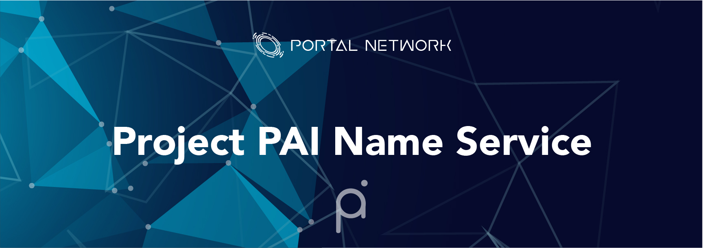

> 📖🔍 Documents of the Project PAI Name Service.

## 📝 Description

PNS is the Project PAI Name Service, a distributed, open, and extensible naming system based on the Project PAI blockchain.

## 📚 Documents

#### Table of Contents
-  [Introduction](./docs/INTRODUCTION.md)

## 📣 Contributing
See [CONTRIBUTING.md](./CONTRIBUTING.md) for how to help out.

## 🗒 Licence
See [LICENSE](./LICENSE) for details.
